<p align="center">

</p>
<h1 font-weight:bold> Fooding   </h1><br>
  
# About Fooding

> 『검증된 리뷰와 함께! 사용자 follow 기반 맛집 추천 서비스』

<br>

# Why Fooding

>  음식점 리뷰 검증을 통해 신뢰성 있는 정보와 취향이 비슷한 사용자 기반의 맛집 정보를 제공하기 위해 제작했습니다.

<br>

## __Symbolic Character__ 


## __Tech Stack__  

<p align="center">


</p>
<p align="center">


</p>
<br>

## __Project Structure__

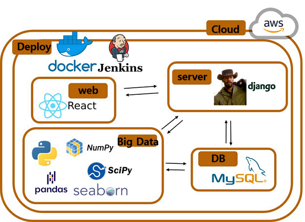

# Install

### __Django__
+ #### 가상환경 생성
 ```
    python -m venv venv
    python manage.py migrate
```
+ #### 가상환경 진입
```
    source venv/Scripts/activate
```
+ #### 패키지 설치
```
    pip install -r requirements.txt
```
+ #### DB 설계
```
    python manage.py migrate
```
+ #### Django 실행
```
    python manage.py runserver
```

<br>

### __React__
+ #### 패키지 설치
```
    npm i
```
+ #### 패키지 실행
```
    npm run start
```
<br>

# 기능

### __회원가입 & 로그인__

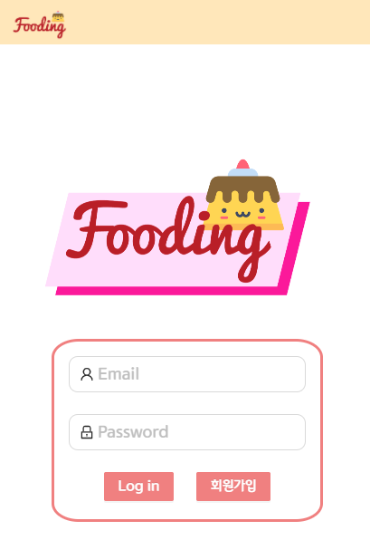
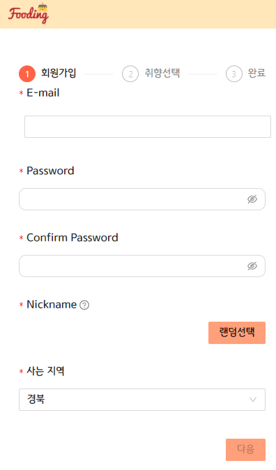
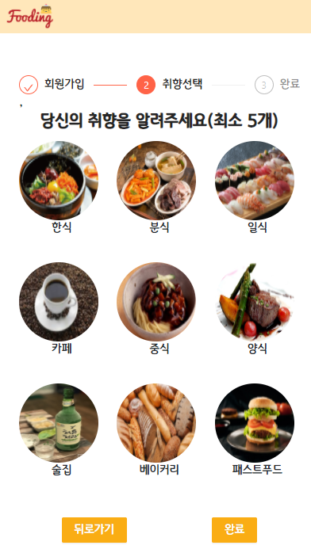
<br>

* 다양한 닉네임을 랜덤하게 제공해주는 서비스 제공
* 가입시 음식 취향 선택을 통해 사용자 기반 맛집 추천


#### __Home__

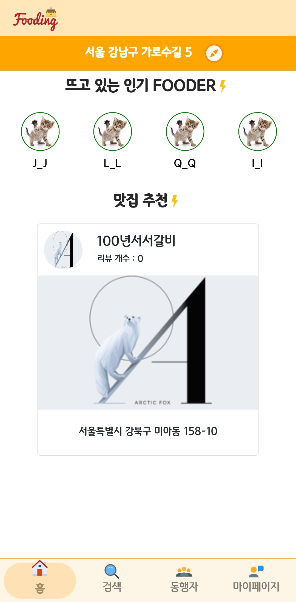
<br>

* 지역 선택을 통해 원하는 지역 정보만 확인 가능
* 인기 Fooder 에 대한 추천 서비스
* 사용자 기반 맛집 정보 제공


#### __Search__

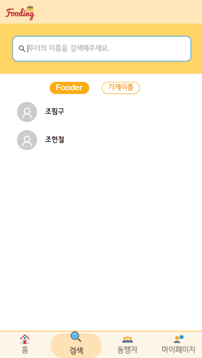
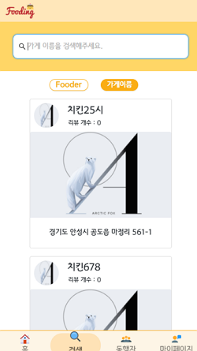
<br>

* Fooder(Spoon 100 ↑)의 사용자 검색 기능
* 가게 검색 기능


#### __Companion__

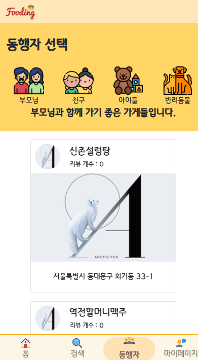
<br>

* 부모님, 친구, 아이, 반려동물의 동행 정보를 통해 사용자 기반 가게 정보 제공
* 가게 찜 기능을 통해 언제든 나중에 확인 가능
* 리뷰 개수 파악으로 사람들의 평가를 확인 가능
 


#### __MyPage__

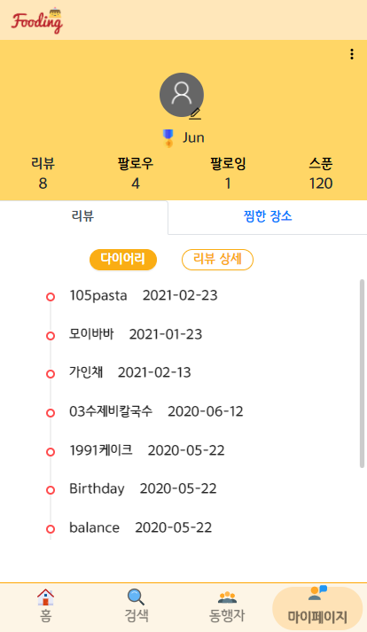
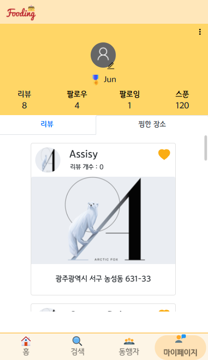
<br>

* 닉네임, 비밀번호 변경 기능 제공
* 팔로우, 팔로잉 유저 확인 및 취소 가능
* Fooder 활동으로 얻은 Spoon Point 확인 가능

* 작성한 리뷰의 다이어리 형식과 상세 정보 조회 가능
* 찜한 장소에 대한 조회 가능


#### __Store__

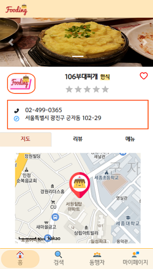
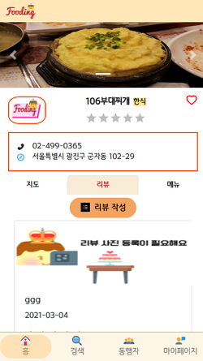
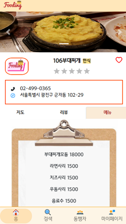
<br>

* 영수증을 OCR 기능으로 신뢰성 있는 리뷰 작성 가능
* 가게 상세 정보 조회 가능

<br>

# 세부 기획

### __ER-Diagram__

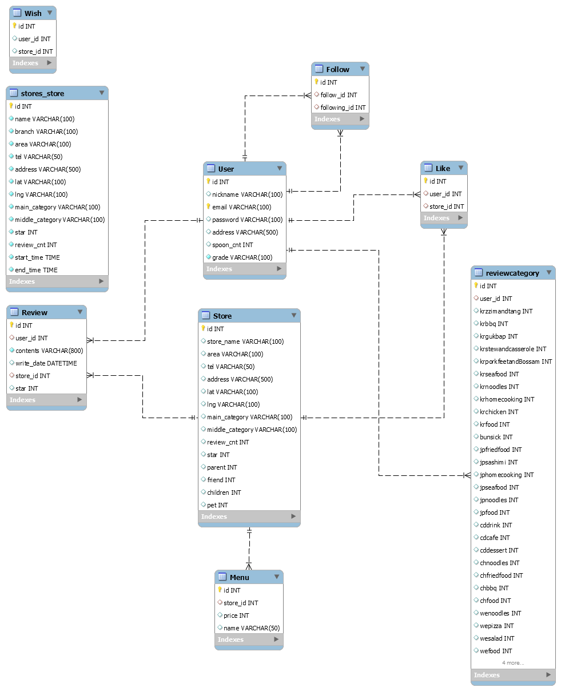


### __DB Table__


### __Wire Frame__

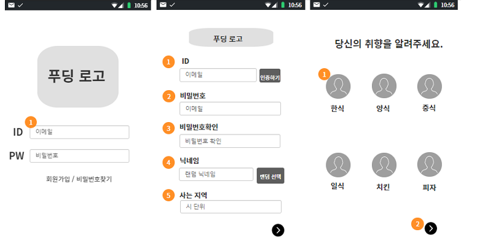


# 팀원 소개 및 역할


